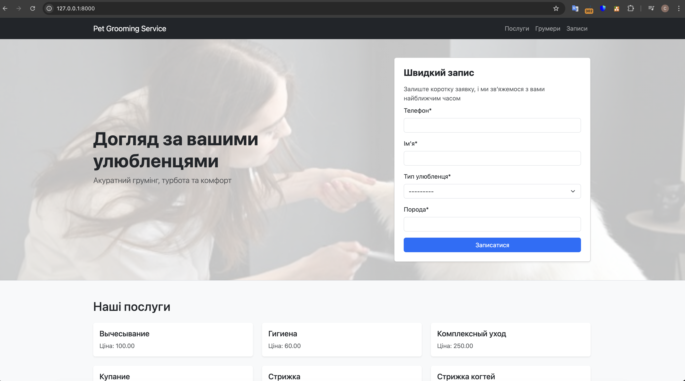

# Pet Grooming Service

A Django web application for managing pet grooming services, appointments and clients.

A full-featured Django web application for managing pet grooming services, including client cabinet, appointment booking, and admin management.

## Installation

```bash
git clone https://github.com/your-repo.git
cd pet_grooming_service

python -m venv venv
source venv/bin/activate  # Windows: venv\Scripts\activate

pip install -r requirements.txt

python manage.py migrate
python manage.py runserver
```

## Features

- User authentication (login/logout)
- Client cabinet
- Appointment creation and management
- Groomer and service listing with search
- Admin panel

## Tech Stack

- Python 3
- Django
- SQLite
- Bootstrap 5

## Project Structure

pet_grooming_service/
├── grooming/
├── templates/п
├── static/
├── manage.py

## Demo



## Running Tests
```bash
python manage.py test
```

## Author

- GitHub: https://github.com/ilchukserhii